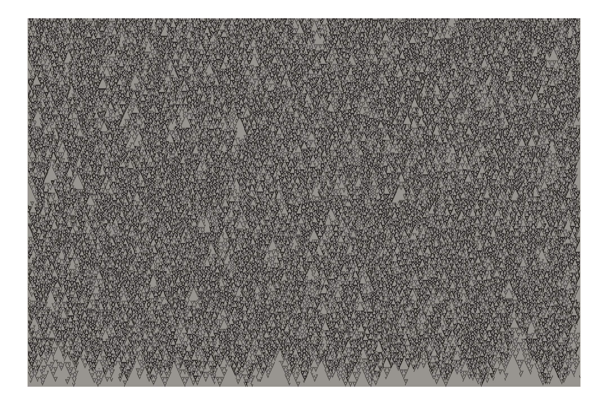
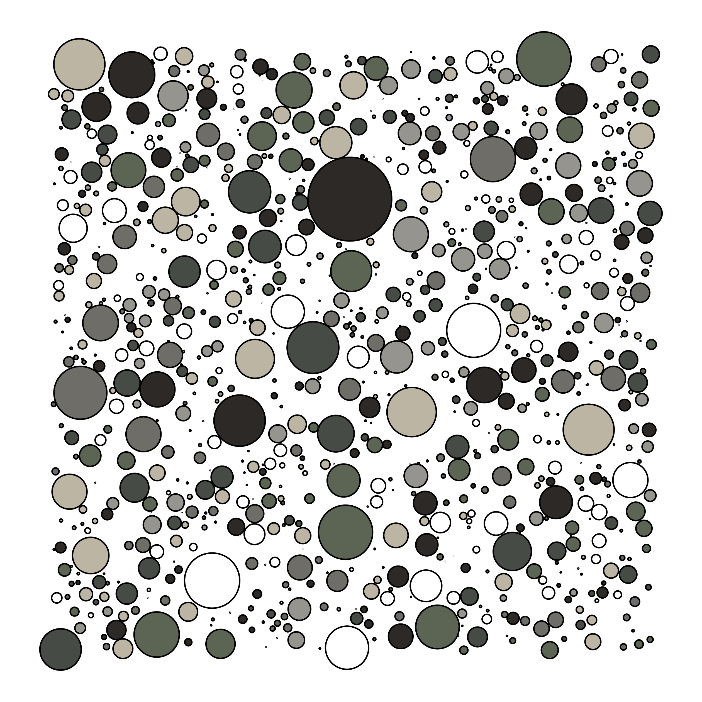

<!-- README.md is generated from README.Rmd. Please edit that file -->

# Generative-aRt

<!-- badges: start -->
<!-- badges: end -->

This repository is my attempt at generative art. Very much still a
working progress, check back in 30 years when I’m much more skilled💩

## 1. Random walk

-   Motivation: to create a hex sticker image for
    [PalCreatoR](https://github.com/GenChangHSU/PalCreatoR)

-   I first used
    [`create_pal`](https://genchanghsu.github.io/PalCreatoR/reference/create_pal.html)
    to generate color for 2 separate images, which I will use to color
    the paths of my random walk

-   The random walk algorithm I wrote is really simple:

    1.  Setup starting points by drawing randomly from normal
        distribution 3 times for each of the x, y, z axes
    2.  Step 1 is repeated, depending on how many **“walks”** one wishes
        to make
    3.  Every **step** has a total of 3 possibilities: i) move back
        (-1), ii) don’t move (0), or iii) move forward (+1) and the
        probability for any one of the 3 possibility is the same. So
        steps are drawn from this pool of possibilities with the number
        of times equal to how many **steps** one wishes to take
    4.  Just to make it more fun, one can modify the **step size** that
        each walk can take by drawing from either a uniform distribution
        or exponential distribution
    5.  For demonstration, I created 2 separate walking scenarios, where
        one set of walks has more **“more walks”** and **“less steps”**
        and another with “less walks” and “more steps”
    6.  Each set of walks was color coded by each of the color palette,
        with each walk within each set assigned randomly to one of the
        colors in the palette

-   [script](https://github.com/jiaangou/Generative-aRt/blob/master/random-walk-art.R)

``` r
magick::image_read('random-walk-static.jpg')
```


``` r
magick::image_read('random-walks.gif')
```

<!-- -->

## 2. 1D-Cellular Automaton

-   Motivation: I’ve recently become obsessed with *complexity science*
    which I’ll admit is a loaded term. But the gist of it is the
    phenomenon in which complex structures and patterns can emerge from
    (relatively) simple rules. Cellular automatons (CAs) are the perfect
    toy models that allow you to play with these rules and be able to
    visualize the result.

-   The model: The 1-D CAs are the simplest type of CAs. Picture a tape
    of cells, with length equal 10. Going through the tape the first
    time (t = 1), all the cells contain the number 0 except for the
    center cell (cell \#5) which contains 1. Now, you make another tape
    of the same length, but the you assign values to the cells according
    to the to the values of the cell at the previous tape (tape \# 1).
    How those values of the previous tape is translated to the new tape,
    is your “rule”. Iterate this process for how many times you want and
    visualize what kind of patterns your rule creates!

-   Details of my simple algorithm:

    1.  Initiate a matrix with `nrow` = number of iterations
        (`iterations`) and `ncol` = length/size of your tape (`N`)
    2.  Fill in the initials conditions (1 or 0) of the cells in the
        first tape.
    3.  Iterate through the rows (outer loop) and iterate through the
        cells of the row (inner loop)\_
    4.  RULE: At each cell, check the states of the adjacent cells of
        the previous tape. If, there is exactly one cell that is
        activated (=1) in the neighborhood, then active focal cell
        (focal cell = 1). If not, do nothing (state = 0).
    5.  Just to spice things up a little, the `error` parameter
        introduces error to the application of the rule. For example, a
        cell that is NOT supposed to be activated, gets activated with a
        given probability equal to the value of `error`.
    6.  Alternatively, you can also supply a matrix through the `mat`
        argument (this will ignore `N` and `iterations` arguments) which
        allows you to construct any hypothetical conditions in which the
        algorithms is applied. For example, you might want more than
        just a single point in the middle of the first tape, or maybe
        you want to know what happens when tapes have activated cells
        before they are even updated.

-   [script](https://github.com/jiaangou/Generative-aRt/blob/master/oneD_CA.R)

``` r
magick::image_read('1D_CA.jpg')
```



## 3. Bubbly Universe

-   Motivation: I’ve been pondering a lot about whether continuity
    exists in the universe. In computers, everything is discrete and
    continuity is only approximated. For example, curves only appear
    curved because the discrete steps are so small; the curves are
    essentially “filled” with little straight lines. But this kind of
    “filling” phenomenon also happens in the real world, like the
    discrete water molecules that fill our cups. This “circle filling”
    algorithm was inspired with that in mind. The idea is to illustrate
    continuity and discreteness all in one figure!

-   [script](https://github.com/jiaangou/Generative-aRt/blob/master/circles.R)

``` r
magick::image_read('bubbly_universe.png')
```


